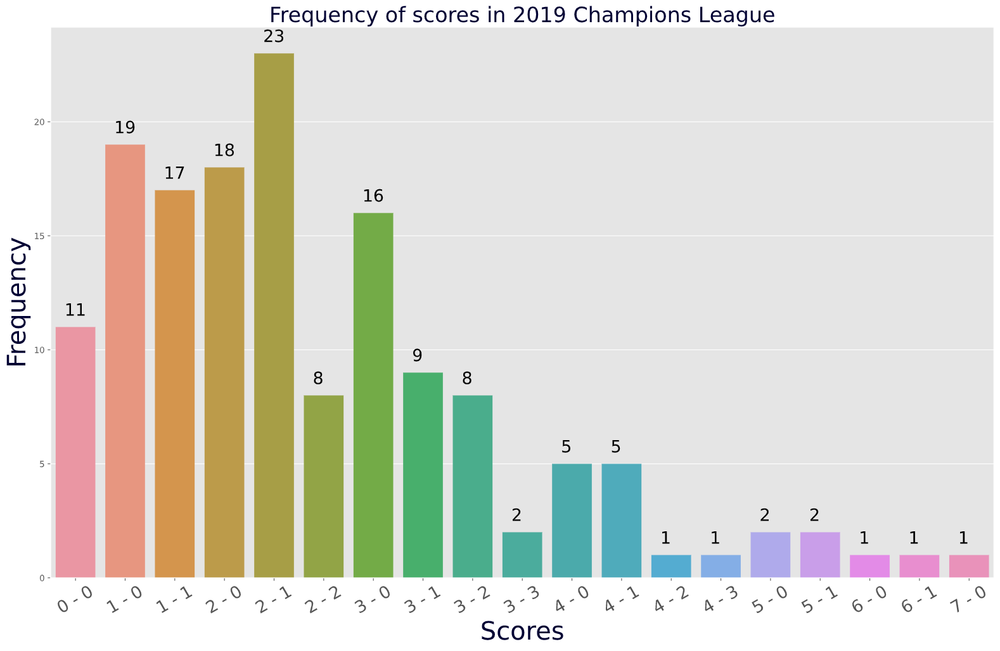

# **<u>Champions League Scrapper</u>**

This is a web scraping script in which you can modify the year manually and then generate a bar graph for the scores of the Champions League at that year.

Here are some examples for the 2017 , 2018 and 2019 Champions League.

------

------

------

------

### **<u>Finding a match from score</u>**

If you found a certain score interesting , you can call this function and type in the score and it'll return the participating teams.

------

